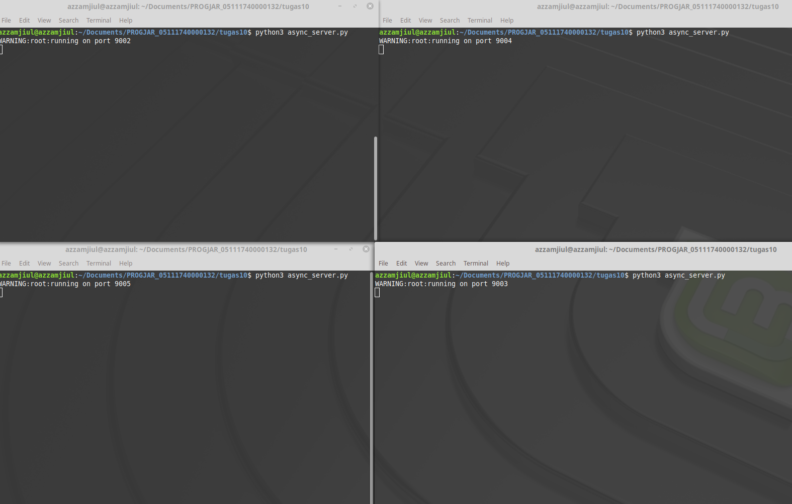
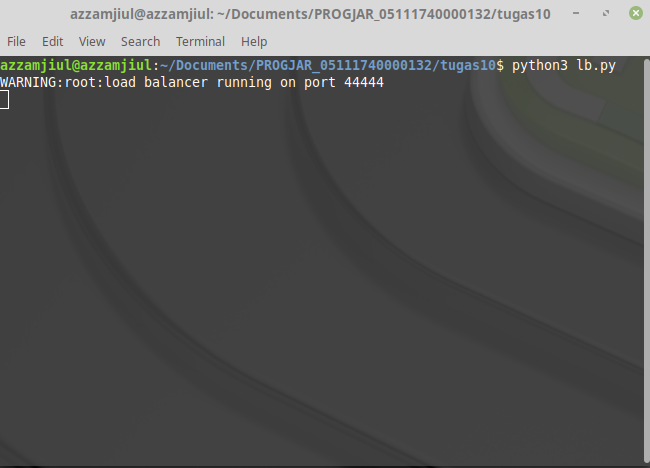
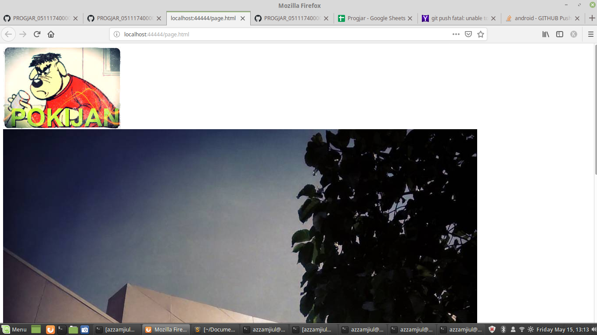
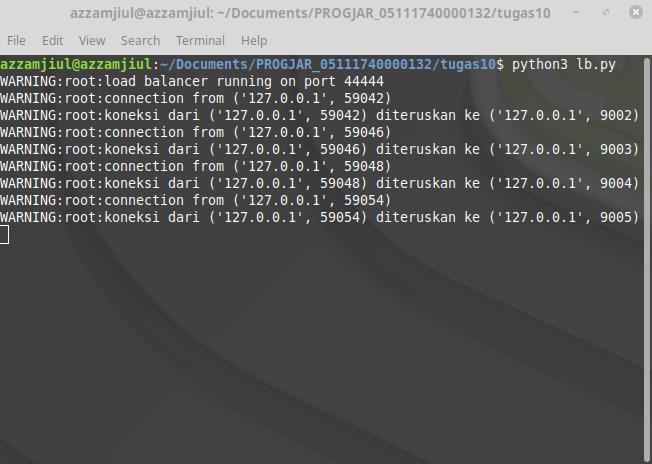
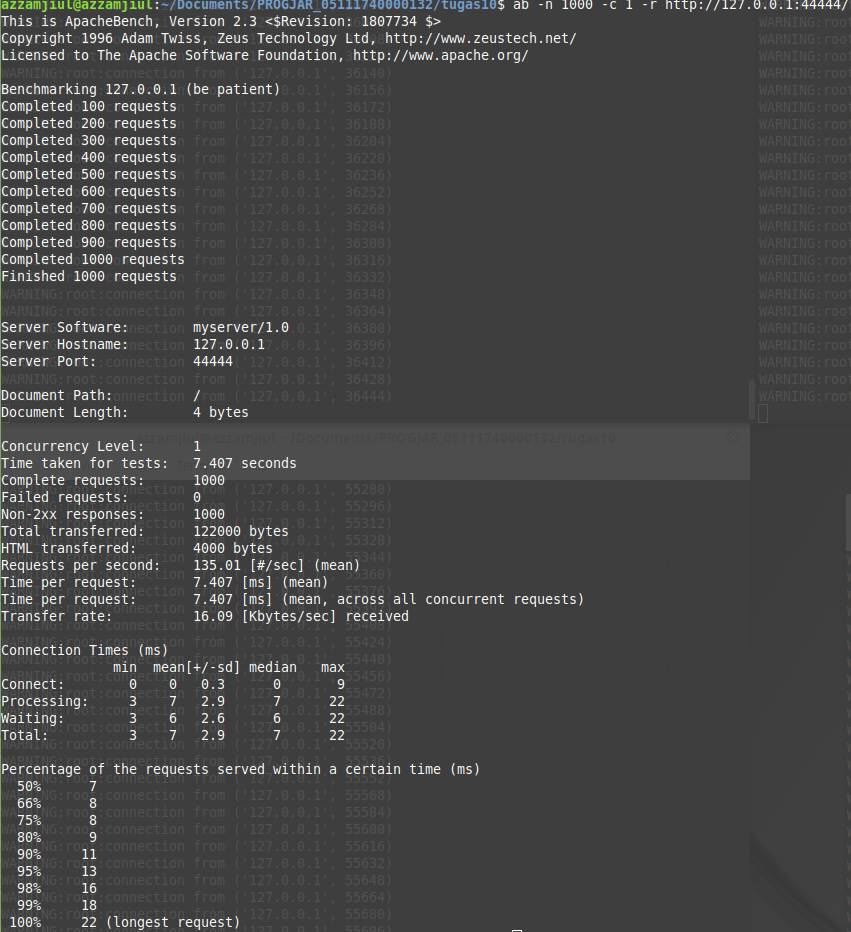
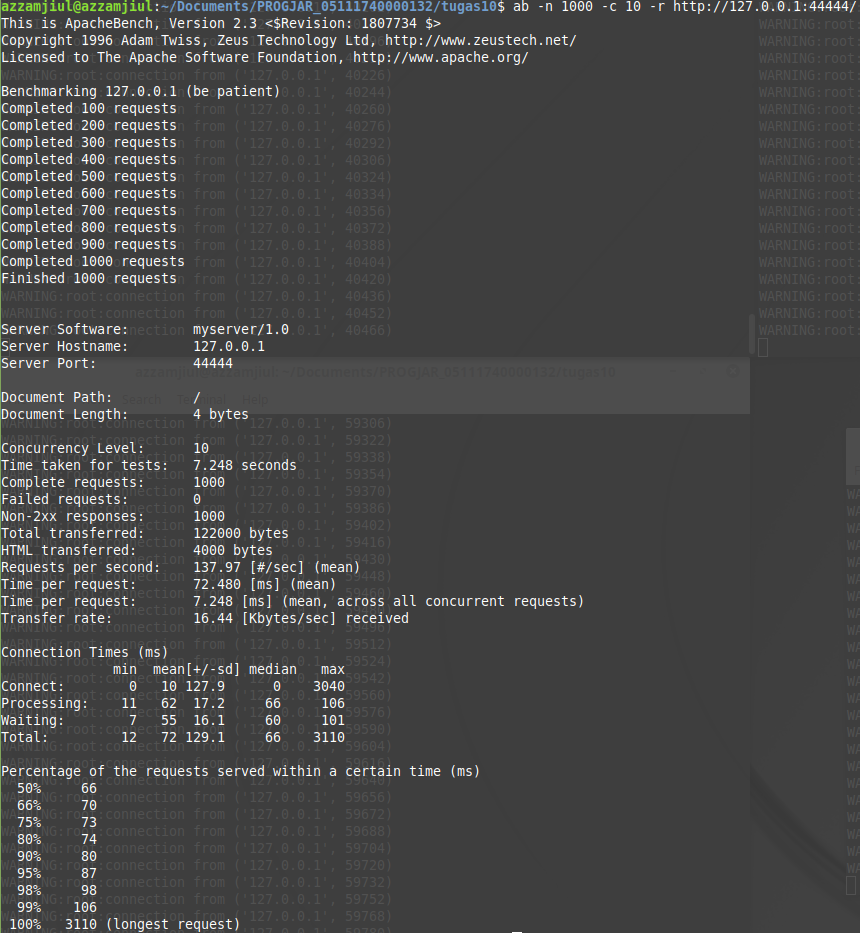
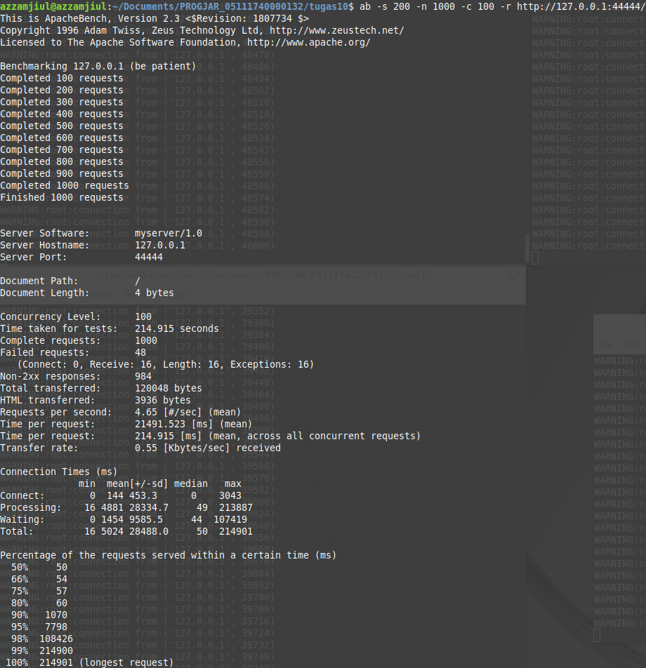
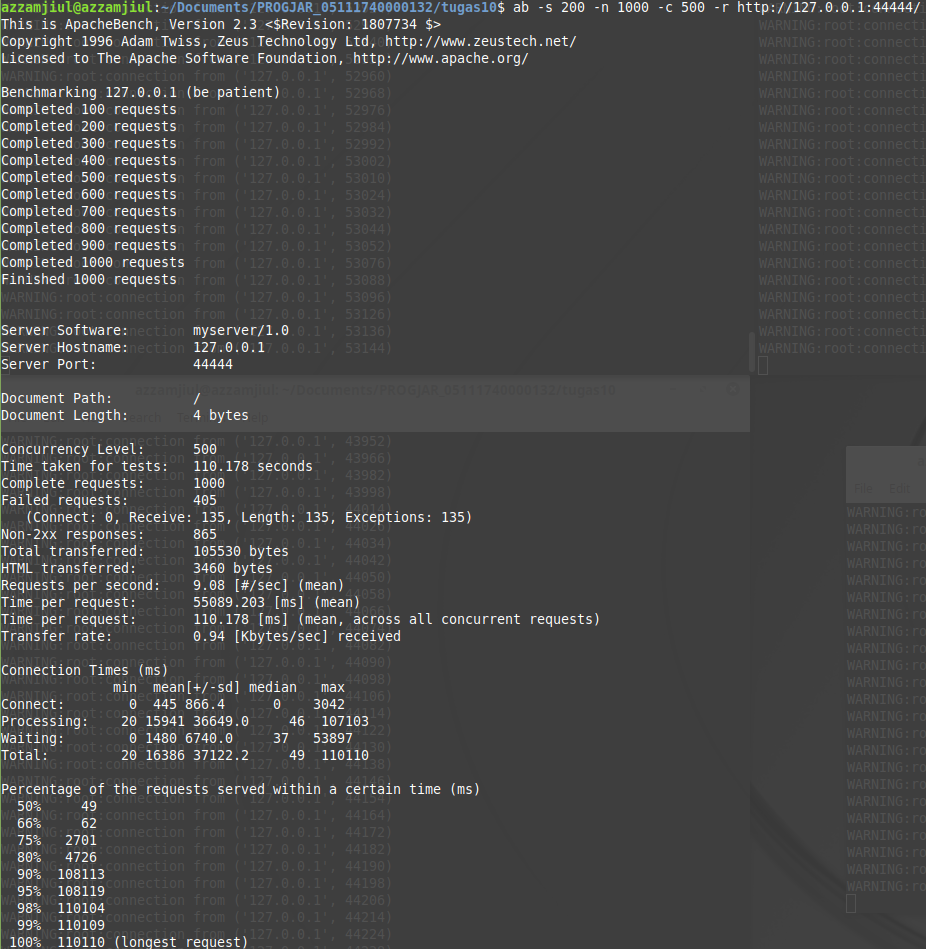
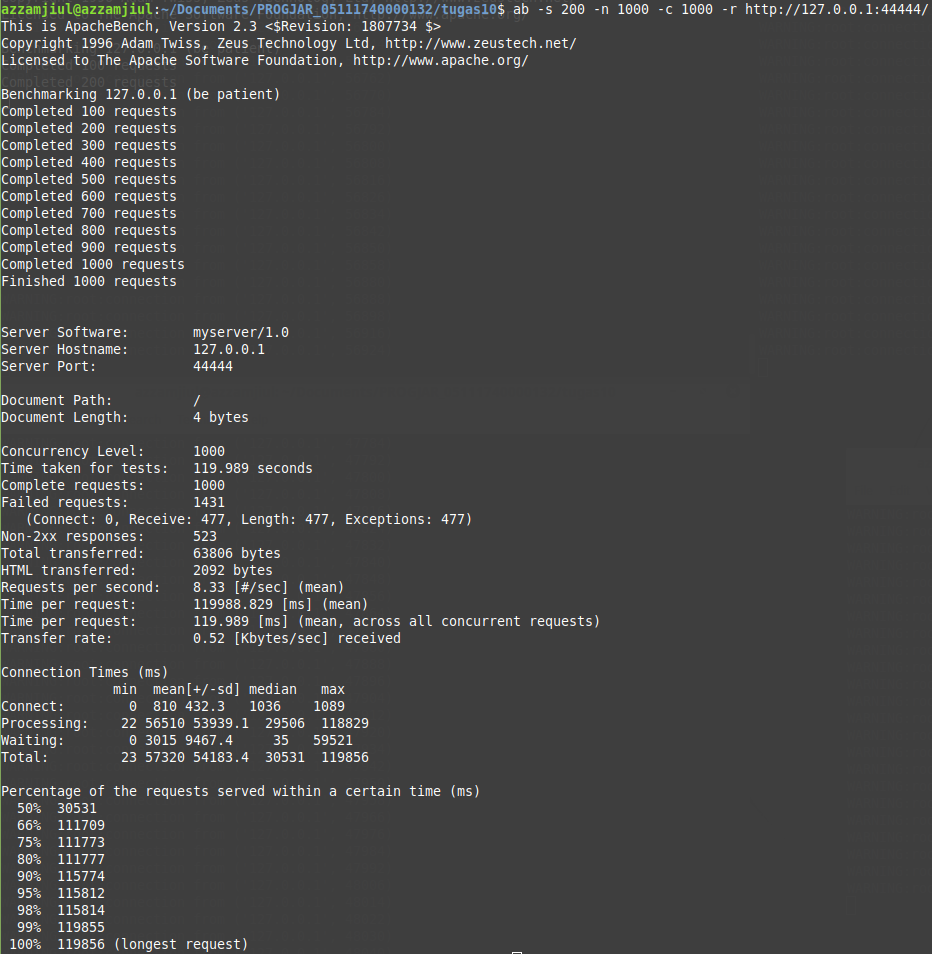

# Tugas 10 Pemrograman Jaringan

## Menjalankan Service

### Setelah pull update terbaru

### Menjalankan async_server.py dengan port 9002, 9003, 9004, 9005

### Menjalankan file lb.py dan menjalankan di port 44444

### Mengakses http://localhost:44444/page.html pada browser

### Mengecek dan melihat proses di log program bahwa setiap request akan dilayani oleh backend secara bergantian

## Hasil performance test

### ab -n 1000 -c 1 -r http://127.0.0.1:44444/

### ab -n 1000 -c 10 -r http://127.0.0.1:44444/

### ab -s 200 -n 1000 -c 100 -r http://127.0.0.1:44444/

### ab -s 200 -n 1000 -c 500 -r http://127.0.0.1:44444/

### ab -s 200 -n 1000 -c 1000 -r http://127.0.0.1:44444/

