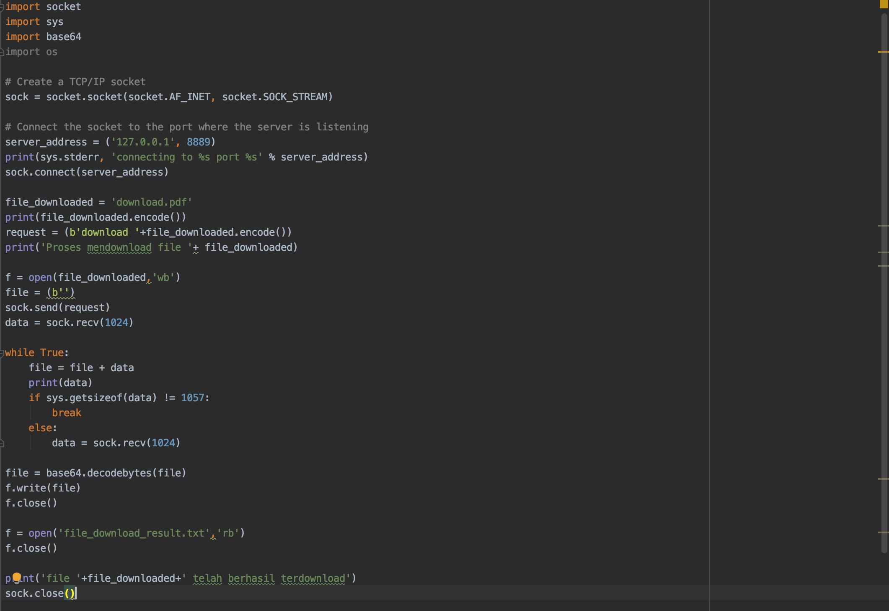

#Tugas 4 Progjar C 2020

## Soal 1 - Merancang Protokol

### Server
#### Dokumentasi Server
##### Bagian 1

##### Bagian 2

#### Sedang Menajalankan Server

### a. Meletakkan (Upload) file
#### [1] sedang menjalankan client upload

#### [2] sebelum menjalankan client upload

#### [3] sesudah menjalankan client upload

### b. Mengambil (Download) file
#### [1] sedang menjalankan client download

#### [2] sebelum menjalankan client download

#### [3] sesudah menjalankan client download

#### [4] penampakan hasil download

### c. Melihat List File
#### [1] sedang menjalankan client list

## Soal 2 - Membuat Dokumentasi Protokol

## Soal 3 - Gunakan Format JSON

## Soal 4 - Buatlah client untuk setiap operasi
### Client Upload

### Client Download

### Client List
