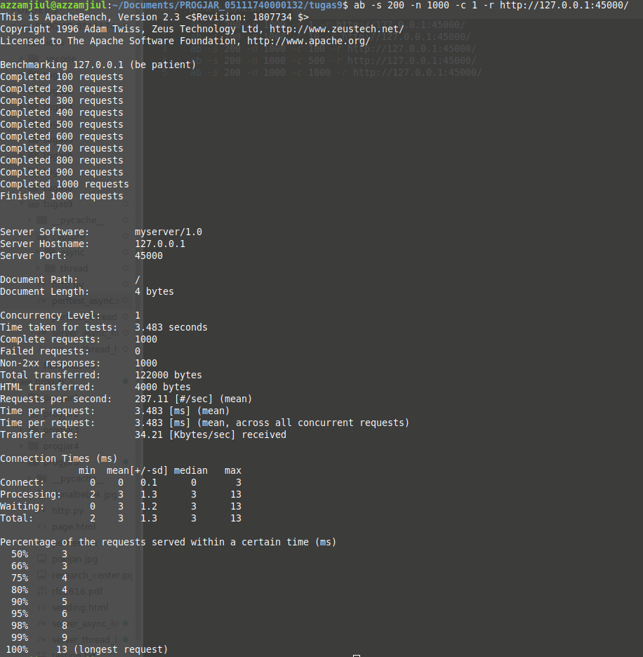
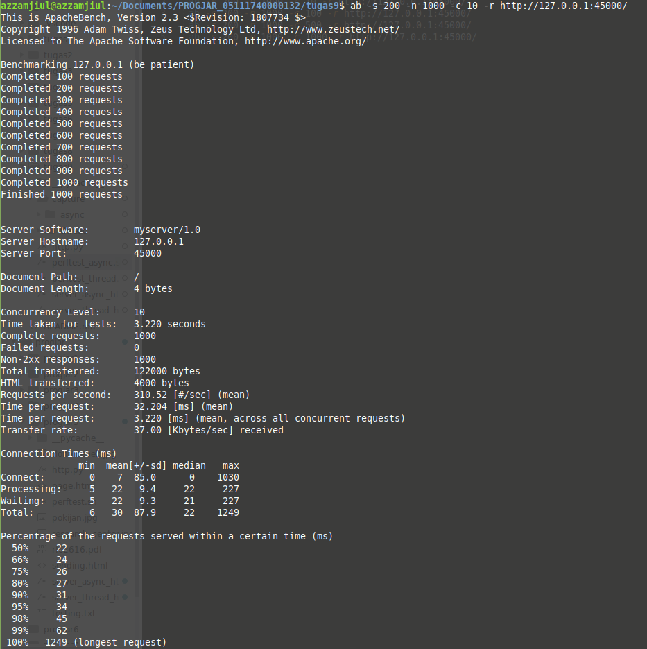
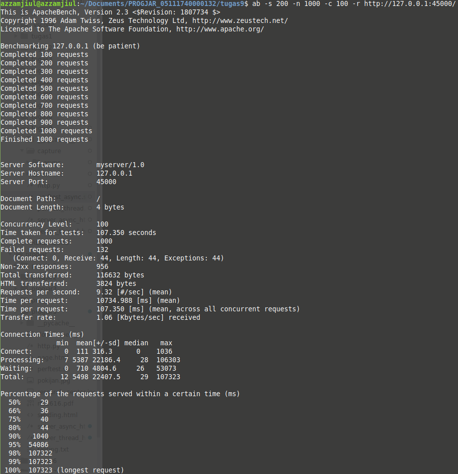
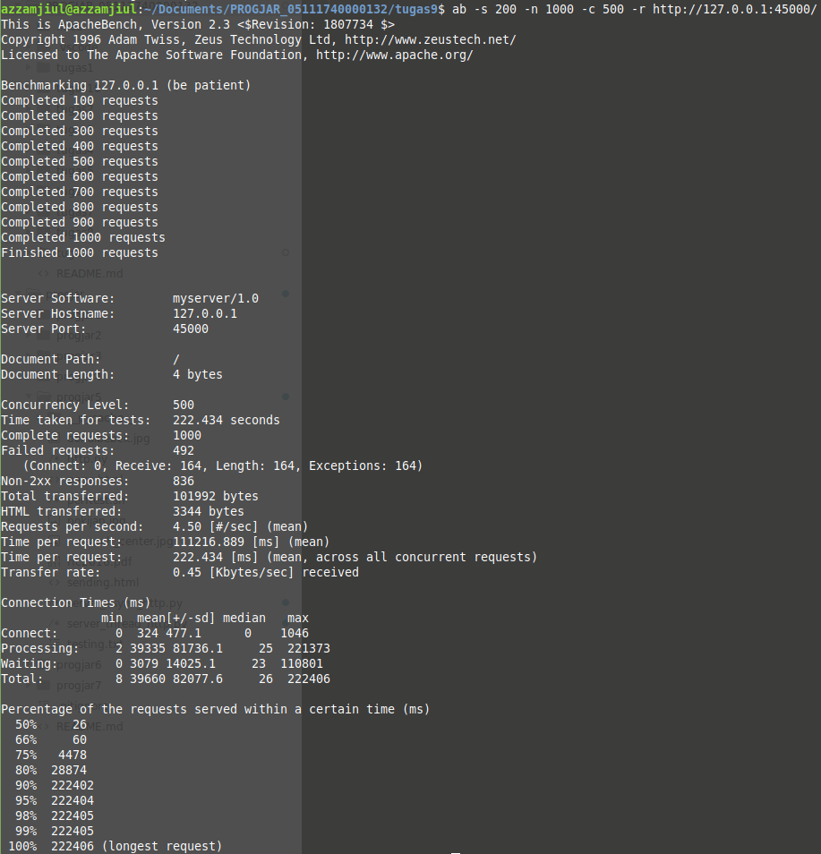
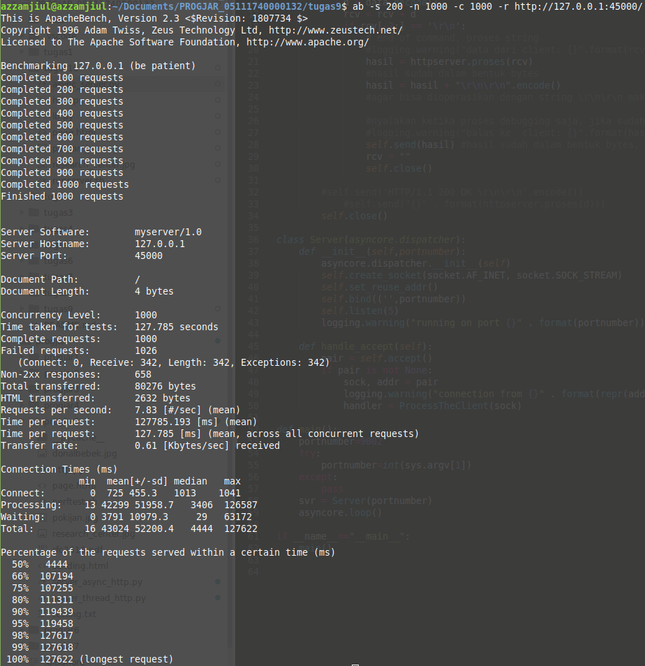

# Tugas 9 Pemrograman Jaringan

## File server_async_http.py

### ab -s 200 -n 1000 -c 1 -r http://127.0.0.1:45000/

### ab -s 200 -n 1000 -c 10 -r http://127.0.0.1:45000/

### ab -s 200 -n 1000 -c 100 -r http://127.0.0.1:45000/

### ab -s 200 -n 1000 -c 500 -r http://127.0.0.1:45000/

### ab -s 200 -n 1000 -c 1000 -r http://127.0.0.1:45000/

## File server_thread_http.py